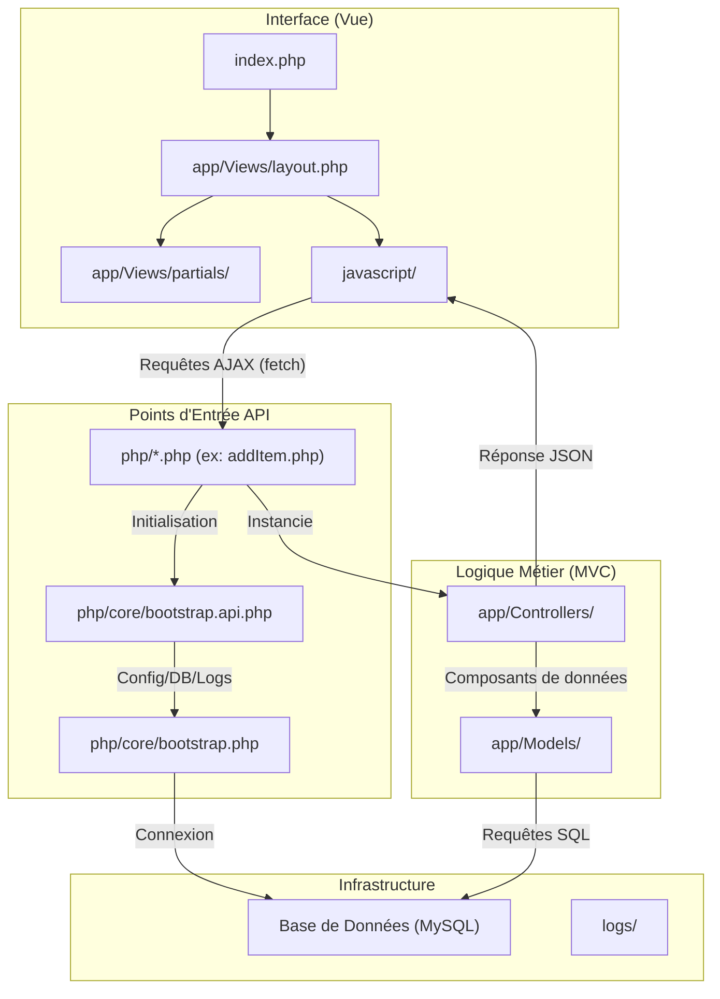

# Gestion de Matériel

Application web de gestion d'inventaire matériel. Permet la gestion complète d'objets (ajout, modification, suppression, consultation) et de caisses (regroupement d'objets).

## Architecture

L'application suit une architecture **MVC (Modèle-Vue-Contrôleur)** personnalisée, où les interactions frontend sont gérées par des appels AJAX vers des points d'entrée API en PHP.



> [!TIP]
> Pour plus de détails sur le fonctionnement interne, consultez le document [Architecture et Fonctionnement](app_data_dir/brain/3f25eb71-2eb4-4a78-87c5-c23b44c06e0d/architecture_overview.md).

## Structure des fichiers

```
├── .env                    # Variables d'environnement (secrets)
├── .env.example            # Template .env (commité)
├── .gitignore
├── README.md
├── index.php               # Point d'entrée principal (Layout MVC)
├── app/                    # Code source de l'application (MVC)
│   ├── Controllers/        # Logique de traitement (ItemController, etc.)
│   ├── Models/             # Accès aux données (Box, Item, etc.)
│   └── Views/              # Templates HTML et partials
├── bdd/                    # Scripts SQL de création de la BDD
├── css/
│   ├── input.css           # Source Tailwind
│   └── output.css          # CSS compilé (Tailwind)
├── javascript/
│   ├── sortUtils.js            # Utilitaire de tri centralisé
│   ├── universalAutocomplete.js # Autocomplétion texte/code-barre
│   ├── filterConsultation.js   # Filtres de l'inventaire
│   ├── addItem.js / addBox.js  # Gestions des formulaires
│   └── ...                     # Scripts interactifs divers
├── php/
│   ├── core/                    # Infrastructure commune (Bootstrap, DB, Logger)
│   ├── addItem.php / addBox.php # Points d'entrée API (Actions)
│   ├── monitor.php              # Health check & monitoring
│   └── ...                      # Endpoints API divers
└── logs/                        # Logs applicatifs (rotation quotidienne)
```

## Installation

### Prérequis

- XAMPP (Apache + MySQL/MariaDB + PHP 8.0+)
- Node.js (pour Tailwind CSS, optionnel)

### Configuration

1. **Cloner le projet** dans le dossier `htdocs` de XAMPP
2. **Configurer la base de données** :
   ```bash
   cp .env.example .env
   ```
   Éditer `.env` avec vos identifiants BDD
3. **Importer la base de données** :
   ```sql
   source BDD/BDD_test_gestion_materiel_mariadb.sql
   ```
4. **Démarrer XAMPP** (Apache + MySQL)
5. **Accéder à l'application** : `http://localhost/Projet de fin d'année BTS/index.php`

## Principes appliqués

### SOLID

- **Single Responsibility** : Chaque classe PHP a une responsabilité unique
  - `EnvLoader` → chargement des variables d'environnement
  - `Logger` → logging applicatif
  - `Database` → connexion BDD
  - `ApiResponse` → formatage des réponses API

### DRY (Don't Repeat Yourself)

- `bootstrap.php` remplace le boilerplate dupliqué dans 16 endpoints
- `ApiResponse` centralise le formatage JSON (avant : `json_encode()` dupliqué partout)
- `sortUtils.js` centralise la logique de tri (avant : dupliquée dans 3 fichiers JS)

### KISS (Keep It Simple, Stupid)

- Architecture simple : pas de framework, pas d'ORM, pas de routing complexe
- Classes utilitaires légères et focalisées
- Pas de dépendances externes côté PHP (sauf FPDF pour les PDF)

## Gestion des secrets

Les credentials ne sont **jamais en dur** dans le code. Ils sont stockés dans `.env` :

```
DB_HOST=localhost
DB_NAME=gestion_materiel_db
DB_USER=root
DB_PASS=motdepasse_ici
```

Le fichier `.env` est dans `.gitignore`. Un template `.env.example` est fourni.

## Logging & Monitoring

### Logs applicatifs

Les logs sont écrits dans `logs/app-YYYY-MM-DD.log` avec rotation quotidienne.

**Format** : `[timestamp] [LEVEL] [endpoint] message {contexte JSON}`

**Niveaux** : `DEBUG`, `INFO`, `WARNING`, `ERROR` (configurable via `LOG_LEVEL` dans `.env`)

**Exemple** :

```
[2026-03-05 14:30:00] [INFO] [addItem.php] Matériel ajouté {"type":"Casque","nom":"Audio Pro","nombre":3}
[2026-03-05 14:31:12] [ERROR] [deleteItem.php] Exception non gérée {"message":"SQLSTATE[...]"}
```

### Monitoring (Health Check)

Endpoint : `php/monitor.php`

Retourne en JSON :

- **database** : statut de la connexion BDD
- **disk** : espace disque utilisé/libre
- **errors** : nombre d'erreurs dans la dernière heure
- **logs** : taille du fichier de log du jour
- **alerts** : alertes si trop d'erreurs détectées

### Alerting

Le monitoring génère des alertes automatiques si :

- Plus de 10 erreurs détectées dans la dernière heure → statut `degraded`
- Espace disque > 90% utilisé → warning

## Sécurité et Gestion des Droits

### Authentification & Autorisation Centralisées

La sécurisation des accès intervient dès le point d'entrée de l'API (`php/core/bootstrap.php`). 
Avant même d'exécuter la logique d'un contrôleur, le bootstrap appelle le script `IHM_admin/auth_check.php`.
- **Mécanisme :** Vérification de la présence et de la validité de la session d'administration. (Expiration de la session après 15 minutes d'inactivité).
- **Résultat :** Si la session est invalide, l'accès est bloqué et l'utilisateur est redirigé (ou reçoit une erreur HTTP). Seuls les utilisateurs authentifiés peuvent exécuter la logique métier.
- **Principe DRY :** Grâce à ce filtre globalisé, les Contrôleurs n'ont pas besoin de refaire des vérifications de rôles individuelles.

### Sécurité Base de Données (PDO)

Toutes les interactions avec la base de données (situées dans `app/Models/`) utilisent exclusivement **PDO** (PHP Data Objects).
Pour prévenir toute faille par injection SQL, l'application utilise systématiquement des **requêtes préparées**. Les données dynamiques (saisies utilisateurs) ne sont jamais concaténées directement dans les requêtes SQL.

## API Endpoints

| Méthode | Endpoint                                    | Description                 |
| ------- | ------------------------------------------- | --------------------------- |
| GET     | `php/getAllItems.php`                  | Liste tous les matériels    |
| GET     | `php/getItemDetails.php?code_barre=X` | Détails d'un matériel       |
| POST    | `php/addItem.php`                      | Ajouter du matériel         |
| POST    | `php/updateItem.php`                   | Modifier un matériel        |
| POST    | `php/deleteItem.php`                   | Supprimer un matériel       |
| POST    | `php/restituteItem.php`                | Restituer un matériel       |
| GET     | `php/getAllBoxes.php`                   | Liste toutes les caisses    |
| GET     | `php/getBoxDetails.php?nom=X`          | Détails d'une caisse        |
| POST    | `php/addBox.php`                        | Ajouter une caisse          |
| POST    | `php/updateBox.php`                     | Modifier une caisse         |
| POST    | `php/deleteBox.php`                     | Supprimer une caisse        |
| GET     | `php/getReferencesList.php`            | Liste des références        |
| GET     | `php/getReferenceTree.php`             | Arborescence des références |
| POST    | `php/addReference.php`                 | Ajouter une référence       |
| POST    | `php/updateReference.php`              | Modifier une référence      |
| POST    | `php/deleteReferences.php`             | Supprimer une référence     |
| GET     | `php/searchUniversal.php?type=X&query=Y`   | Recherche universelle       |
| GET     | `php/searchBarcodes.php?query=X`       | Recherche codes-barres      |
| GET     | `php/getIds.php`                       | Recherche d'IDs par type/nom|
| GET     | `php/getAvailableObjects.php`             | Objets disponibles          |
| GET     | `php/getUsers.php`                  | Liste des utilisateurs      |
| GET     | `php/checkBarcode.php?code_barre=X`        | Vérifier unicité code-barre |
| GET     | `php/generateBarcode.php`              | Générer des codes-barres    |
| GET     | `php/generateInventoryPdf.php`         | Générer l'inventaire en PDF |
| GET     | `php/getComment.php`                   | Récupérer les commentaires  |
| POST    | `php/saveComment.php`                  | Ajouter un commentaire      |
| POST    | `php/deleteUserComment.php`            | Supprimer com. (utilisateur)|
| POST    | `php/deleteAdminComment.php`           | Supprimer com. (admin)      |
| GET     | `php/monitor.php`                           | Health check                |
