# Gestion de Matériel

Application web de gestion d'inventaire matériel. Permet la gestion complète d'objets (ajout, modification, suppression, consultation) et de caisses (regroupement d'objets).

## Architecture

```mermaid
graph TB
    subgraph "Frontend"
        HTML["Gestion_materiel.html"]
        CSS["CSS/output.css (Tailwind)"]
        JS_CORE["Javascript/"]
        JS_CORE --> SORT["sort_utils.js"]
        JS_CORE --> AC["UniversalAutocomplete.js"]
        JS_CORE --> ACB["UniversalAutocomplete_barcode.js"]
        JS_CORE --> INIT["init_autocompletes.js"]
        JS_CORE --> CRUD_JS["add/delete/update_materiel.js"]
        JS_CORE --> CAISSE_JS["add/delete/update_caisse.js"]
        JS_CORE --> FILTER["filter_consultation.js"]
    end

    subgraph "Backend PHP"
        BOOTSTRAP["core/bootstrap.php"]
        BOOTSTRAP --> ENV["core/EnvLoader.php"]
        BOOTSTRAP --> LOG["core/Logger.php"]
        BOOTSTRAP --> DB["core/Database.php"]
        BOOTSTRAP --> API["core/ApiResponse.php"]

        subgraph "Endpoints"
            MATERIEL_API["add/delete/update/get_materiel*.php"]
            CAISSE_API["add/delete/update/get_caisse*.php"]
            SEARCH_API["search_universal.php / search_codes_barres.php"]
            UTILS_API["check_barcode.php / get_ids.php / get_utilisateurs.php"]
            MONITOR["monitor.php"]
        end
    end

    subgraph "Données"
        ENV_FILE[".env"]
        LOGS["logs/app-YYYY-MM-DD.log"]
        BDD["MySQL/MariaDB"]
    end

    HTML --> JS_CORE
    HTML --> CSS
    JS_CORE -->|"fetch() API"| MATERIEL_API
    JS_CORE -->|"fetch() API"| CAISSE_API
    JS_CORE -->|"fetch() API"| SEARCH_API
    BOOTSTRAP --> ENV_FILE
    LOG --> LOGS
    DB --> BDD
```



## Structure des fichiers

```
├── .env                    # Variables d'environnement (secrets)
├── .env.example            # Template .env (commité)
├── .gitignore
├── README.md
├── Gestion_materiel.html   # Page principale (SPA)
├── BDD/                    # Script SQL de création de la BDD
├── CSS/
│   ├── input.css           # Source Tailwind
│   └── output.css          # CSS compilé
├── Javascript/
│   ├── sort_utils.js            # Utilitaire de tri centralisé (DRY)
│   ├── UniversalAutocomplete.js # Autocomplétion texte
│   ├── UniversalAutocomplete_barcode.js # Autocomplétion code-barre
│   ├── init_autocompletes.js    # Initialisation des autocomplétions
│   ├── filter_consultation.js   # Filtres et tri de l'inventaire
│   ├── add_materiel.js          # Formulaire ajout matériel
│   ├── delete_materiel.js       # Formulaire suppression matériel
│   ├── update_materiel.js       # Formulaire modification matériel
│   ├── add_caisse.js            # Formulaire ajout caisse
│   ├── delete_caisse.js         # Formulaire suppression caisse
│   ├── update_caisse.js         # Formulaire modification caisse
│   ├── barcode_generator.js     # Génération de codes-barres
│   ├── download_pdf.js          # Export PDF
│   ├── textFieldLoader.js       # Chargement dynamique des champs
│   ├── caisse_form_toggle.js    # Toggle formulaires caisse
│   └── form_actions.js          # Actions formulaires
├── PHP/
│   ├── core/                    # Infrastructure commune
│   │   ├── bootstrap.php        # Point d'entrée unique
│   │   ├── EnvLoader.php        # Chargement .env
│   │   ├── Logger.php           # Système de logging
│   │   ├── Database.php         # Connexion PDO
│   │   └── ApiResponse.php      # Réponses JSON standardisées
│   ├── db_connect.php           # Wrapper rétrocompatible
│   ├── monitor.php              # Health check & monitoring
│   ├── add_materiel.php         # POST — Ajouter matériel
│   ├── delete_materiel.php      # POST — Supprimer matériel
│   ├── update_materiel.php      # POST — Modifier matériel
│   ├── get_all_materiel.php     # GET — Liste tous les matériels
│   ├── get_materiel_details.php # GET — Détails d'un matériel
│   ├── add_caisse.php           # POST — Ajouter caisse
│   ├── delete_caisse.php        # POST — Supprimer caisse
│   ├── update_caisse.php        # POST — Modifier caisse
│   ├── get_all_caisses.php      # GET — Liste toutes les caisses
│   ├── get_caisse_details.php   # GET — Détails d'une caisse
│   ├── get_available_objects.php # GET — Objets disponibles
│   ├── search_codes_barres.php  # GET — Recherche codes-barres
│   ├── search_universal.php     # GET — Recherche universelle
│   ├── check_barcode.php        # GET — Vérifier unicité code-barre
│   ├── get_ids.php              # GET — IDs par type/nom
│   ├── get_utilisateurs.php     # GET — Liste utilisateurs
│   └── generate_inventory_pdf.php # GET — Génération PDF
└── logs/                        # Logs applicatifs (gitignored)
    └── app-YYYY-MM-DD.log
```

## Installation

### Prérequis

- XAMPP (Apache + MySQL/MariaDB + PHP 8.0+)
- Node.js (pour Tailwind CSS, optionnel)

### Configuration

1. **Cloner le projet** dans le dossier `htdocs` de XAMPP
2. **Configurer la base de données** :
   ```bash
   cp .env.example .env
   ```
   Éditer `.env` avec vos identifiants BDD
3. **Importer la base de données** :
   ```sql
   source BDD/BDD_test_gestion_materiel_mariadb.sql
   ```
4. **Démarrer XAMPP** (Apache + MySQL)
5. **Accéder à l'application** : `http://localhost/Projet de fin d'année BTS/Gestion_materiel.html`

## Principes appliqués

### SOLID

- **Single Responsibility** : Chaque classe PHP a une responsabilité unique
  - `EnvLoader` → chargement des variables d'environnement
  - `Logger` → logging applicatif
  - `Database` → connexion BDD
  - `ApiResponse` → formatage des réponses API

### DRY (Don't Repeat Yourself)

- `bootstrap.php` remplace le boilerplate dupliqué dans 16 endpoints
- `ApiResponse` centralise le formatage JSON (avant : `json_encode()` dupliqué partout)
- `sort_utils.js` centralise la logique de tri (avant : dupliquée dans 3 fichiers JS)

### KISS (Keep It Simple, Stupid)

- Architecture simple : pas de framework, pas d'ORM, pas de routing complexe
- Classes utilitaires légères et focalisées
- Pas de dépendances externes côté PHP (sauf FPDF pour les PDF)

## Gestion des secrets

Les credentials ne sont **jamais en dur** dans le code. Ils sont stockés dans `.env` :

```
DB_HOST=localhost
DB_NAME=gestion_materiel_db
DB_USER=root
DB_PASS=motdepasse_ici
```

Le fichier `.env` est dans `.gitignore`. Un template `.env.example` est fourni.

## Logging & Monitoring

### Logs applicatifs

Les logs sont écrits dans `logs/app-YYYY-MM-DD.log` avec rotation quotidienne.

**Format** : `[timestamp] [LEVEL] [endpoint] message {contexte JSON}`

**Niveaux** : `DEBUG`, `INFO`, `WARNING`, `ERROR` (configurable via `LOG_LEVEL` dans `.env`)

**Exemple** :

```
[2026-03-05 14:30:00] [INFO] [add_materiel.php] Matériel ajouté {"type":"Casque","nom":"Audio Pro","nombre":3}
[2026-03-05 14:31:12] [ERROR] [delete_materiel.php] Exception non gérée {"message":"SQLSTATE[...]"}
```

### Monitoring (Health Check)

Endpoint : `PHP/monitor.php`

Retourne en JSON :

- **database** : statut de la connexion BDD
- **disk** : espace disque utilisé/libre
- **errors** : nombre d'erreurs dans la dernière heure
- **logs** : taille du fichier de log du jour
- **alerts** : alertes si trop d'erreurs détectées

### Alerting

Le monitoring génère des alertes automatiques si :

- Plus de 10 erreurs détectées dans la dernière heure → statut `degraded`
- Espace disque > 90% utilisé → warning

## Statelessness

L'application est **sans état** (stateless) :

- Aucune session PHP (`$_SESSION`) utilisée
- Chaque requête HTTP est indépendante
- La connexion BDD est créée par requête, pas partagée entre requêtes
- Pas de fichiers temporaires côté serveur (sauf logs)
- Toutes les données transitent via l'API JSON

Cela facilite le **passage à l'échelle** : l'application peut être déployée derrière un load balancer sans problème de synchronisation d'état.

## API Endpoints

| Méthode | Endpoint                                    | Description                 |
| ------- | ------------------------------------------- | --------------------------- |
| GET     | `PHP/get_all_materiel.php`                  | Liste tous les matériels    |
| GET     | `PHP/get_materiel_details.php?code_barre=X` | Détails d'un matériel       |
| POST    | `PHP/add_materiel.php`                      | Ajouter du matériel         |
| POST    | `PHP/update_materiel.php`                   | Modifier un matériel        |
| POST    | `PHP/delete_materiel.php`                   | Supprimer un matériel       |
| GET     | `PHP/get_all_caisses.php`                   | Liste toutes les caisses    |
| GET     | `PHP/get_caisse_details.php?nom=X`          | Détails d'une caisse        |
| POST    | `PHP/add_caisse.php`                        | Ajouter une caisse          |
| POST    | `PHP/update_caisse.php`                     | Modifier une caisse         |
| POST    | `PHP/delete_caisse.php`                     | Supprimer une caisse        |
| GET     | `PHP/search_universal.php?type=X&query=Y`   | Recherche universelle       |
| GET     | `PHP/search_codes_barres.php?query=X`       | Recherche codes-barres      |
| GET     | `PHP/get_available_objects.php`             | Objets disponibles          |
| GET     | `PHP/get_utilisateurs.php`                  | Liste des utilisateurs      |
| GET     | `PHP/check_barcode.php?code_barre=X`        | Vérifier unicité code-barre |
| GET     | `PHP/monitor.php`                           | Health check                |
